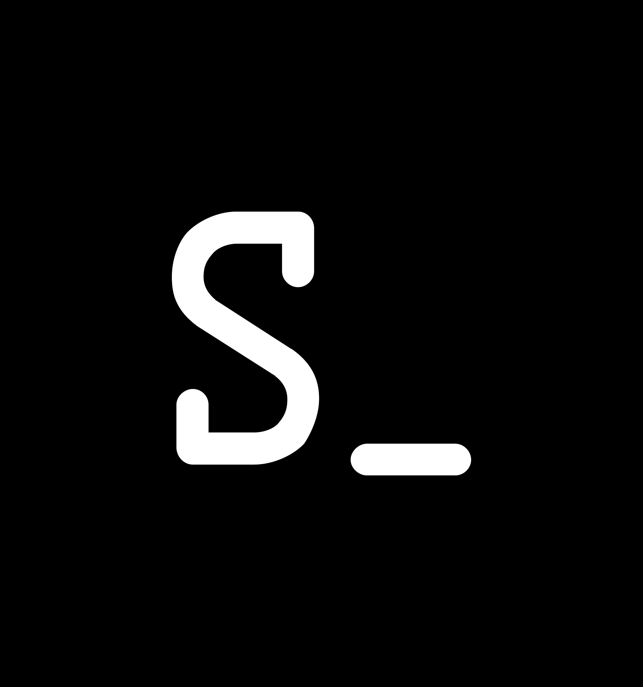

 
  Olá meu nome é Silvio, sou desenvolvedor <strong>Web e Mobile</strong>. 
  Estou em busca de oportunidades de trabalho!

  </> Habilidades: <strong>JavaScript, React, React Native, MongoDB, MYSQL, Firebase, HTML, CSS e Bootstrap.</strong>

  💼 Ferramentas: <strong>VsCode, Figma, Heroku, Netlify, Git e GitHub.</strong>

  Caso tenha interesse de conhecer melhor meu trabalho, entre em contato nos links abaixo: ⤵️

  

  

  

  

